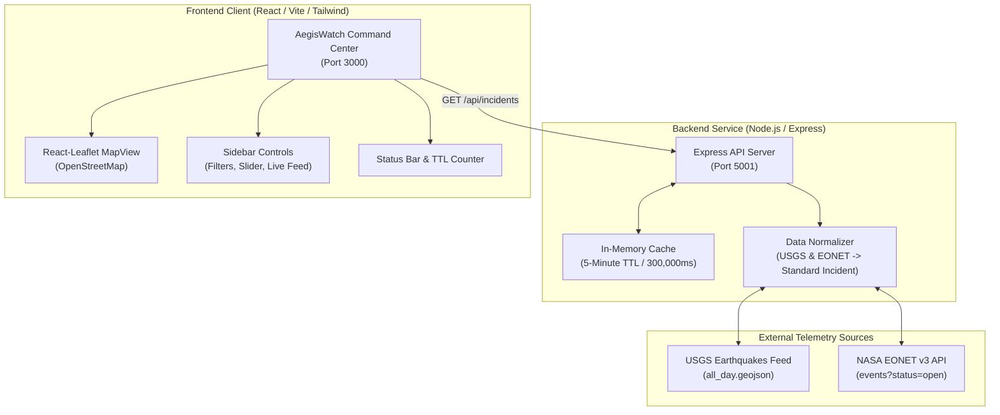

# AegisWatch | Real-Time Global Incident & Environmental Tracker

A production-ready, full-stack geospatial telemetry platform that tracks, normalizes, and visualizes real-time natural hazard events across the globe. Powered by live data from **USGS (United States Geological Survey)** and **NASA EONET (Earth Observatory Natural Event Tracker)**, cached with a 5-minute TTL in-memory layer, and rendered on an interactive dark command-center world map built with **React**, **Tailwind CSS**, and **React-Leaflet**.

---

## 📑 Table of Contents

1. [Architecture Overview](#-architecture-overview)
2. [External APIs Used](#-external-apis-used)
3. [How Backend Normalization Works](#-how-backend-normalization-works)
4. [In-Memory Caching Architecture](#-in-memory-caching-architecture)
5. [Local Development Guide](#-local-development-guide)
6. [Production Deployment Guide](#-production-deployment-guide)
   - [Backend on Render](#1-backend-deployment-on-render)
   - [Frontend on Vercel](#2-frontend-deployment-on-vercel)
7. [API Reference](#-api-reference)
8. [Project Structure](#-project-structure)

---

## 🏛 Architecture Overview



---

## 🛰 External APIs Used

The backend aggregates live telemetry from two public APIs:

### 1. USGS Earthquake API
- **Endpoint**: `https://earthquake.usgs.gov/earthquakes/feed/v1.0/summary/all_day.geojson`
- **Description**: Real-time stream of all seismic events recorded globally within the past 24 hours. Updated by USGS every minute.
- **Protocol & Format**: HTTP GET, GeoJSON (`FeatureCollection`).
- **Raw Geometry**: `[longitude, latitude, depth_in_km]`.
- **Key Raw Fields**: `properties.mag` (Richter magnitude), `properties.place` (location name), `properties.time` (Unix timestamp in ms), `properties.url` (USGS event detail page), `properties.tsunami` (tsunami warning flag).

### 2. NASA EONET v3 API (Earth Observatory Natural Event Tracker)
- **Endpoint**: `https://eonet.gsfc.nasa.gov/api/v3/events?status=open`
- **Description**: Curated database of natural hazard events continuously tracked by NASA satellites and partner institutions (IRWIN, JTWC, NOAA).
- **Protocol & Format**: HTTP GET, JSON (`events` array).
- **Tracked Categories**:
  - `wildfires`: Active forest and brush fires with burn area (in acres) and satellite detection coordinates.
  - `severeStorms`: Active tropical cyclones, typhoons, and hurricanes with historic wind speeds (in knots) and trajectory tracking coordinates.
- **Key Raw Fields**: `categories` (category id & title), `geometry` (array of chronological coordinate points with `magnitudeValue` and `magnitudeUnit`), `sources` (official agency URLs).

---

## 🔄 How Backend Normalization Works

Both raw feeds use fundamentally different data structures, coordinate conventions, and magnitude units. The normalizer ([`server/services/normalizer.js`](server/services/normalizer.js)) unifies them into a single standard schema.

### Standard Normalized Incident Schema

```typescript
interface Incident {
  id: string;                      // Unique ID (e.g. "usgs_tx2026spjoic", "eonet_EONET_24317")
  title: string;                   // Human-readable title
  category: 'earthquake' | 'wildfire' | 'storm'; // Strict primary category
  magnitude: number | null;        // Numeric intensity value
  magnitudeUnit: string;           // "mag" (Richter), "acres" (burn area), "kts" (wind speed)
  severity: 'low' | 'moderate' | 'high' | 'critical'; // Unified severity rating
  coordinates: {
    lat: number;                   // Latitude (-90 to +90)
    lng: number;                   // Longitude (-180 to +180)
  };
  timestamp: number;               // Epoch millisecond timestamp
  dateFormatted: string;           // ISO 8601 UTC string
  source: 'USGS' | 'NASA EONET';   // Telemetry source name
  url: string;                     // External official event page URL
  location: string;                // Location description or region
  details: Record<string, any>;    // Category-specific metadata
}
```

### Transformation Process

#### 1. Coordinate Extraction & Validation
- **GeoJSON Standard**: USGS and NASA GeoJSON express coordinates in `[longitude, latitude, elevation]`.
- **Normalization**: Coordinates are mapped to `{ lat: coords[1], lng: coords[0] }` with boundary checks (`lat` within `[-90, 90]`, `lng` within `[-180, 180]`).
- **Multi-point Geometries**: For NASA storm tracking containing multiple observations across time, the normalizer sorts observations chronologically and selects the **latest/most recent position** (`geometry[geometry.length - 1]`). For polygon wildfire boundaries, the centroid is calculated.

#### 2. Category Normalization
- **USGS**: Mapped to `'earthquake'`.
- **NASA EONET**:
  - Category `wildfires` $\rightarrow$ `'wildfire'`.
  - Category `severeStorms`, `cyclones`, `typhoons`, `hurricanes` $\rightarrow$ `'storm'`.
  - Non-primary categories (such as sea ice or minor alerts) are filtered out to maintain high-signal tracking.

#### 3. Severity Scoring Algorithm
A normalized severity indicator (`low`, `moderate`, `high`, `critical`) is computed dynamically based on category thresholds:

| Severity | Earthquakes (Richter) | Wildfires (Burn Area) | Severe Storms (Wind Speed) |
|---|---|---|---|
| **Low** | $< 2.5$ | $< 500$ acres | $< 35$ kts (Tropical depression) |
| **Moderate** | $2.5 - 4.4$ | $500 - 5,000$ acres | $35 - 63$ kts (Tropical storm) |
| **High** | $4.5 - 6.4$ | $5,000 - 25,000$ acres | $64 - 95$ kts (Category 1–2 Hurricane) |
| **Critical** | $\ge 6.5$ | $> 25,000$ acres | $> 95$ kts (Category 3–5 Hurricane) |

---

## ⚡ In-Memory Caching Architecture

To prevent spamming external public endpoints and avoid upstream rate limiting, the backend implements an in-memory cache ([`server/cache.js`](server/cache.js)):

1. **5-Minute TTL (300,000 ms)**: Data fetched from USGS and NASA is stored in memory with an expiration timestamp (`expiresAt = Date.now() + 300000`).
2. **Hit/Miss Telemetry**: Each response includes `cacheInfo` containing:
   - `cached`: boolean
   - `cachedAt`: timestamp when the cache was populated
   - `expiresAt`: expiration timestamp
   - `ttlRemainingSeconds`: remaining seconds until cache expires
   - `hits` / `misses`: counters tracking cache performance
3. **Instantaneous Response**: Cache hits return in `< 2ms`, compared to ~10–15 seconds for a full external multi-API roundtrip.
4. **Manual Cache Invalidation**: The endpoint `POST /api/incidents/refresh` allows busting the cache on demand.

---

## 💻 Local Development Guide

### Prerequisites
- **Node.js**: v18.0.0 or higher (v20+ recommended)
- **npm**: v9.0.0 or higher

### 1. Clone & Install Dependencies
```bash
git clone <repository-url>
cd disaster-tracker

# Install all dependencies (root, backend, and frontend)
npm run install:all
```

### 2. Start Both Servers (One-Command)
```bash
npm run dev
```
This runs both the backend and frontend concurrently:
- **Frontend Dashboard**: [http://localhost:3000](http://localhost:3000)
- **Backend API**: [http://localhost:5001](http://localhost:5001)

### 3. Run Servers Individually (Optional)
To run the backend server only:
```bash
cd server
npm install
npm run dev # Starts Express server with --watch on http://localhost:5001
```

To run the frontend client only:
```bash
cd client
npm install
npm run dev # Starts Vite dev server on http://localhost:3000
```

---

## 🚀 Production Deployment Guide

This project is separated into a **backend API service** (suitable for Render) and a **static SPA frontend** (suitable for Vercel).

---

### 1. Backend Deployment on Render

#### Option A: 1-Click Render Blueprint (Recommended)
This repository includes a [`render.yaml`](render.yaml) specification:
1. Log in to your [Render Dashboard](https://dashboard.render.com).
2. Click **New +** $\rightarrow$ **Blueprint**.
3. Connect this GitHub repository.
4. Render will automatically detect `render.yaml`, configure the `disaster-tracker-api` web service, set the build and start commands, and deploy.

#### Option B: Manual Web Service Setup
1. On Render, click **New +** $\rightarrow$ **Web Service**.
2. Connect your Git repository.
3. Configure the following settings:
   - **Name**: `disaster-tracker-api`
   - **Region**: Any (e.g., Oregon or Frankfurt)
   - **Root Directory**: `server`
   - **Runtime**: `Node`
   - **Build Command**: `npm install`
   - **Start Command**: `node server.js`
   - **Instance Type**: `Free`
4. Add the following **Environment Variables**:
   | Key | Value | Notes |
   |---|---|---|
   | `NODE_ENV` | `production` | Enables production optimizations |
   | `PORT` | `10000` | (Render sets this automatically) |
   | `ALLOWED_ORIGINS` | `*` or `https://your-app.vercel.app` | Comma-separated list of allowed frontend origins |
5. Click **Deploy Web Service**.
6. Once deployed, note down your Render URL (e.g., `https://disaster-tracker-api.onrender.com`).
7. Verify health:
   ```bash
   curl https://<your-render-app>.onrender.com/api/health
   ```

---

### 2. Frontend Deployment on Vercel

1. Log in to your [Vercel Dashboard](https://vercel.com/dashboard).
2. Click **Add New...** $\rightarrow$ **Project**.
3. Import this Git repository.
4. Configure the project settings:
   - **Framework Preset**: `Vite`
   - **Root Directory**: Click *Edit* and select **`client`**
   - **Build Command**: `npm run build` (or leave default)
   - **Output Directory**: `dist` (or leave default)
5. Under **Environment Variables**, add:
   | Key | Value | Description |
   |---|---|---|
   | `VITE_API_BASE_URL` | `https://disaster-tracker-api.onrender.com` | Your live Render backend URL (no trailing slash) |
6. Click **Deploy**.
7. Vercel will build the React application and deploy it with SPA routing rewrites configured via [`client/vercel.json`](client/vercel.json).
8. (Optional) Return to Render and update `ALLOWED_ORIGINS` with your newly generated Vercel production URL.

---

## 📡 API Reference

### `GET /api/incidents`
Returns normalized incidents with cache metadata.

**Query Parameters**:
- `category` *(optional)*: Comma-separated list (`earthquake`, `wildfire`, `storm`, or `all`).
- `minMag` *(optional)*: Number (e.g. `4.5`). Filters incidents with magnitude $\ge$ `minMag`.
- `search` *(optional)*: String keyword to filter by title or location.
- `limit` *(optional)*: Integer limit of incidents to return (default: `1500`, or `all`).
- `refresh` *(optional)*: Set to `true` to bypass cache and trigger immediate external fetch.

**Response Example**:
```json
{
  "success": true,
  "totalReturned": 2,
  "stats": {
    "total": 7323,
    "earthquakes": 217,
    "wildfires": 7105,
    "storms": 1,
    "maxEarthquakeMag": 6.4,
    "severities": { "critical": 88, "high": 323, "moderate": 6511, "low": 401 }
  },
  "cacheInfo": {
    "cached": true,
    "cachedAt": "2026-09-21T08:02:55.931Z",
    "expiresAt": "2026-09-21T08:07:55.931Z",
    "ttlRemainingSeconds": 284,
    "hits": 4,
    "misses": 1
  },
  "incidents": [
    {
      "id": "usgs_us7000tiw4",
      "title": "M 5.0 - 34 km WNW of Luwuk, Indonesia",
      "category": "earthquake",
      "magnitude": 5.0,
      "magnitudeUnit": "mag",
      "severity": "high",
      "coordinates": { "lat": -0.8563, "lng": 122.4959 },
      "timestamp": 1789975867967,
      "dateFormatted": "2026-09-21T07:31:07.967Z",
      "source": "USGS",
      "location": "34 km WNW of Luwuk, Indonesia"
    }
  ]
}
```

### `GET /api/incidents/stats`
Returns summary statistics of active events without the full incident array.

### `POST /api/incidents/refresh`
Invalidates the in-memory cache and re-fetches from USGS and NASA immediately.

### `GET /api/health`
Health check endpoint returning uptime and cache status.

---

## 📁 Project Structure

```
disaster-tracker/
├── package.json                 # Root script runner (concurrently running client & server)
├── render.yaml                  # Render Infrastructure-as-Code Blueprint for backend
├── README.md                    # Project documentation
│
├── server/                      # Node.js Express Backend API
│   ├── package.json             # Express, cors, dotenv
│   ├── .env.example             # Backend environment template
│   ├── server.js                # Express app, routes, CORS & error handling
│   ├── cache.js                 # 5-minute in-memory TTL cache with hit/miss tracking
│   └── services/
│       ├── normalizer.js        # USGS & NASA EONET data normalization & severity logic
│       └── incidentService.js   # Multi-source fetch orchestrator & cache coordinator
│
└── client/                      # React Frontend Application (Vite + Tailwind)
    ├── package.json             # React 18/19, Vite, Tailwind CSS, Leaflet, Lucide
    ├── .env.example             # Frontend environment template (VITE_API_BASE_URL)
    ├── vercel.json              # Vercel SPA routing and caching configuration
    ├── vite.config.js           # Vite config with dev proxy to :5001
    ├── tailwind.config.js       # Dark telemetry theme & custom pulse keyframes
    ├── index.html               # Fonts & Leaflet stylesheets
    └── src/
        ├── main.jsx             # React entry point
        ├── App.jsx              # Main dashboard layout, state & filter orchestration
        ├── index.css            # Tailwind directives, custom Leaflet popups & scrollbars
        └── components/
            ├── Header.jsx       # Telemetry header, live pulse & TTL countdown
            ├── Sidebar.jsx      # Category checkboxes, magnitude slider, search & feed
            ├── MapView.jsx      # React-Leaflet world map with custom pulsing markers
            └── StatsBar.jsx     # Bottom status bar with live incident KPIs
```

---

## 📄 License
MIT License. Open-source for educational and public hazard monitoring purposes.
